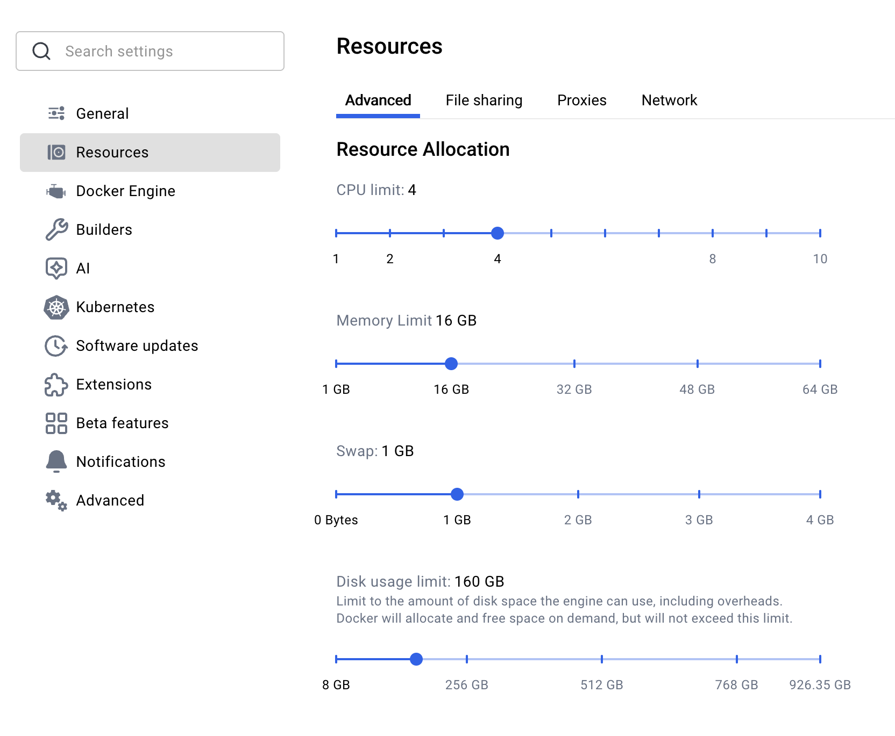
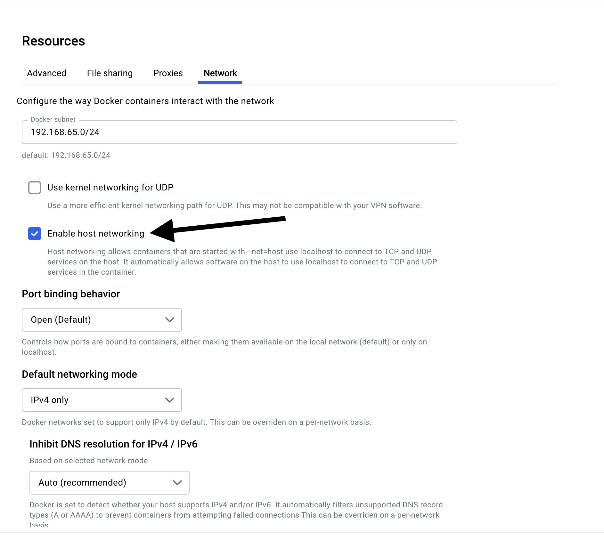

# Setup environment

Use docker swarm and follow a cluster concept (when possible).

1. Docker resources

All stacks have been tested on a docker desktop with the following resources.

> In case you don't have enough resources, you can use a docker desktop with less resources.

<div align="center">



<details>
<summary><strong>Docker Networking</strong></summary>



</details>

</div>

## Creating a docker swarm cluster

To create a docker swarm cluster execute below commands in your favorite terminal

```(shell)
docker swarm init && \
docker node ls && \
docker ps
```

> Great! The swarm cluster is setting up!

If you haven't faced any issue and all above commands worked as expected move forward to next section

---

#### Creating a docker network

Docker allow us to create _overlay_ networks this creating some communication isolation between container(s). Secondly, advantage is the capability to talk with another containers using their service names (I will show some examples later on).

Let's create a docker2docker network to allow comminication between containers **only** in this network by running below command in the terminal.

```(shell)
docker network create docker2docker --subnet 10.1.0.1/16 --driver overlay --attachable && \
docker network ls | grep docker2docker
```

---

### Secrets in docker

One of the great features of docker is manager **secrets** to keep sensitive data such as passwords, tokens, credentials, certificates _encrpyted_.
There are many ways and tools to be used for managing secrets but let's use docker secrets manager for now.

To make it easier creating, managing, updating secrets I am following below strategy.

1. Use openssl to generate one time secret
   1. openssl rand -hex 16
2. Store the secret in .bashrc or .zshrc an environment variable and export
   1. Edit .bashrc or .zshrc depending of the current **shell** checking by run (echo $SHELL)
   2. echo "export DOCKER_SECRET_DB=\"$(openssl rand -hex 16)\"" | tee -a $HOME/.zshrc
   3. echo "export GITEA_DOCKER_TOKEN=\"$(openssl rand -hex 16)\"" | tee -a $HOME/.zshrc
   4. echo "export HOMARR_SECRET_KEY=\"$(openssl rand -hex 32)\"" | tee -a $HOME/.zshrc
   4. echo "export AP_ENCRYPTION_KEY=\"$(openssl rand -hex 16)\"" | tee -a $HOME/.zshrc


Run bellow command lines to setup all the steps automatically

```(shell)
echo "export DOCKER_SECRET_DB=\"$(openssl rand -hex 16)\"" | tee -a $HOME/.zshrc
echo "export GITEA_DOCKER_TOKEN=\"$(openssl rand -hex 16)\"" | tee -a $HOME/.zshrc
echo "export HOMARR_SECRET_KEY=\"$(openssl rand -hex 32)\"" | tee -a $HOME/.zshrc
echo "export AP_ENCRYPTION_KEY=\"$(openssl rand -hex 16)\"" | tee -a $HOME/.zshrc
echo "export AP_JWT_SECRET=\"$(openssl rand -hex 32)\"" | tee -a $HOME/.zshrc
echo "export APP_ID=\"$(openssl rand -hex 32)\"" | tee -a $HOME/.zshrc
echo "export APP_KEY=\"$(openssl rand -hex 32)\"" | tee -a $HOME/.zshrc
echo "export PUSHER_APP_ID=\"$(openssl rand -hex 32)\"" | tee -a $HOME/.zshrc
echo "export PUSHER_APP_KEY=\"$(openssl rand -hex 32)\"" | tee -a $HOME/.zshrc
echo "export PUSHER_APP_SECRET=\"$(openssl rand -hex 32)\"" | tee -a $HOME/.zshrc
source $HOME/.zshrc
printenv DOCKER_SECRET_DB | docker secret create DOCKER_SECRET_DB -
printenv GITEA_DOCKER_TOKEN | docker secret create GITEA_DOCKER_TOKEN -
printenv HOMARR_SECRET_KEY | docker secret create HOMARR_SECRET_KEY -
printenv AP_ENCRYPTION_KEY | docker secret create AP_ENCRYPTION_KEY -
printenv AP_JWT_SECRET | docker secret create AP_JWT_SECRET -
echo "$$APP_ID" | docker secret create APP_ID -
echo "$$APP_KEY" | docker secret create APP_KEY -
echo "$$PUSHER_APP_ID" | docker secret create PUSHER_APP_ID -
echo "$$PUSHER_APP_KEY" | docker secret create PUSHER_APP_KEY -
echo "$$PUSHER_APP_SECRET" | docker secret create PUSHER_APP_SECRET -
```

* Verifying secret was created

```(shell)
docker secret ls
```

output:

```sh
ID                          NAME                DRIVER    CREATED          UPDATED
ie6wir6bv5tt2b20zu1abm8gz   database_password             21 minutes ago   21 minutes ago
```

> Awesome! Docker secret has been created

Update your `/etc/hosts` with below entires to access all stacks by their names (no need to type localhost anymore)

```(text)
#### docker-stack: v10 ####
# AI 
127.0.0.1 activepieces.docker.local n8n.docker.local
# Databases
127.0.0.1 redis.docker.local
# Ingress & Proxy stack
127.0.0.1 traefik.swarm.local haproxy.docker.local
127.0.0.1 ngrok-bb.docker.local ngrok-gh.docker.local
# Infrastructure stack
127.0.0.1 atlantis.docker.local consul.docker.local dokku.docker.local dokploy.docker.local
# VCS, CI/CD stack
127.0.0.1 gogs.docker.local
127.0.0.1 droneci-bb.docker.local droneci-gh.docker.local
127.0.0.1 concourse.docker.local harness.docker.local gitea.docker.local gocd.docker.local jenkins.docker.local teamcity.docker.local
# WebUI & Portal stack
127.0.0.1 adminer.docker.local portainer.docker.local devsecopson.docker.local
# Monitoring stack
127.0.0.1 alertmanager.docker.local beszel.docker.local dozzle.docker.local grafana.docker.local prometheus.docker.local jaeger.docker.local
# Logging stack (ELK)
127.0.0.1 elasticsearch.docker.local fluentbit.docker.local kibana.docker.local logstash.docker.local
# Cloud Cost Management stack
127.0.0.1 komiser.docker.local
# Networking stack
# Security stack
127.0.0.1 vault.docker.local passbolt.docker.local
# Storage stack
127.0.0.1 minio.docker.local s3.docker.local openio.docker.local
#### docker-stack ####
```

> Type kake hosts-update


Next: [Deploying services](https://github.com/DevSecOpsBr/docker/blob/master/docs/deploy.md)
